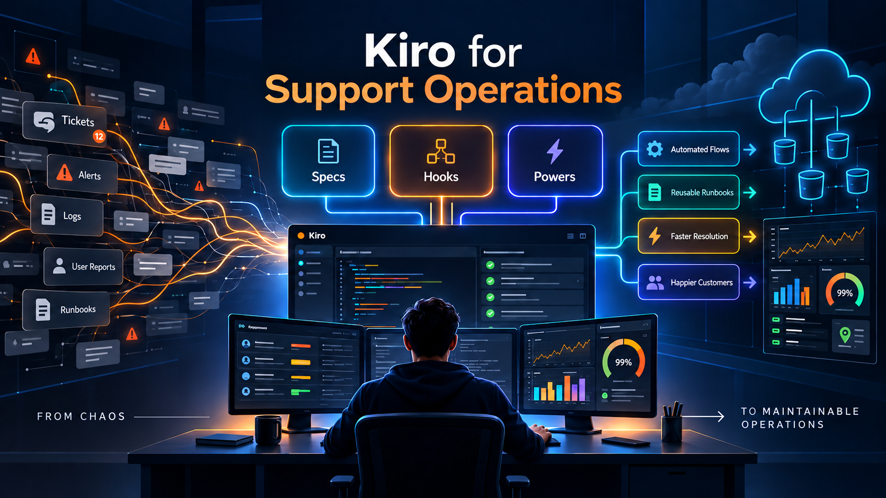

+++
title = "Kiro Y Kiro Powers Para Soporte Ti"
date = "2026-09-14T14:11:24-06:00"
draft = false
description = "Como transformar tickets, logs y conocimiento disperso en flujos reutilizables para soporte TI."
tags = ["kiro", "support", "operations"]
categories = ["cloud operations"]
+++

# Kiro y Kiro Powers

## Salvando el dia un ticket a la vez

Kiro no es solo "otro editor con IA". Es un entorno de desarrollo agentic pensado para llevar ideas, correcciones y automatizaciones desde el prototipo hasta algo mas mantenible.

Para quienes trabajan en soporte, esto importa mucho.

En soporte tecnico solemos vivir entre tickets, logs, documentacion incompleta, scripts repetitivos, cambios urgentes y conocimiento disperso. Kiro puede ayudar a ordenar ese trabajo con tres piezas clave: Specs, Hooks y Kiro Powers.

## Specs: convertir incidentes en trabajo estructurado

Las Specs permiten transformar una necesidad o incidente en requisitos, diseno y tareas. Para soporte, esto puede servir para documentar un bug recurrente, definir criterios de aceptacion para una correccion o convertir una solicitud ambigua en un plan claro.

Por ejemplo: cada semana llegan tickets porque cierto servicio interno responde lento despues de una actualizacion.

En lugar de resolverlo como un caso aislado, se puede crear una spec en Kiro con:

- **Que ocurre:** degradacion de rendimiento despues del despliegue.
- **Impacto:** usuarios afectados, sistemas involucrados y tiempos de respuesta.
- **Criterios de aceptacion:** logs revisados, causa raiz identificada, monitoreo agregado y documentacion actualizada.
- **Tareas:** reproducir el error, revisar metricas, proponer fix y validar en ambiente de prueba.

Asi el incidente deja de ser "un ticket mas" y se convierte en conocimiento reutilizable.

## Hooks: validaciones repetitivas antes de que escalen

Los Hooks automatizan acciones cuando ocurre un evento, como guardar un archivo, ejecutar una herramienta o terminar una tarea. Bien usados, pueden ayudar a correr validaciones, generar documentacion de apoyo, revisar estandares o bloquear acciones riesgosas antes de que escalen.

Imagina que el equipo de soporte mantiene scripts para reiniciar servicios, consultar logs o validar configuraciones.

Un hook podria ejecutarse cada vez que se modifica un script y revisar automaticamente:

- Si el archivo cumple el formato esperado.
- Si no contiene credenciales expuestas.
- Si incluye mensajes claros de error.
- Si la documentacion asociada fue actualizada.

Esto ayuda a reducir errores operativos antes de que lleguen a produccion o a manos del equipo de soporte.

## Kiro Powers: capacidades especializadas bajo demanda

Kiro Powers son paquetes de capacidades especializadas. En lugar de cargar todo el contexto posible, Kiro activa conocimiento, herramientas MCP, skills y buenas practicas segun la tarea.

Esto puede ser muy util cuando el equipo necesita soporte sobre tecnologias especificas: bases de datos, cloud, pagos, observabilidad, seguridad o frameworks concretos.

Si la mayoria de tickets estan relacionados con AWS, bases de datos, Kubernetes o una aplicacion interna, se puede usar o crear un Power enfocado en ese dominio.

Ese Power podria incluir:

- Runbooks comunes.
- Comandos seguros de diagnostico.
- Criterios para escalar incidentes.
- Buenas practicas del equipo.
- Conexion con herramientas internas mediante MCP.

Asi Kiro no responde de forma generica, sino con contexto cercano al entorno real del equipo. Para soporte, ese detalle marca una gran diferencia: menos tiempo buscando informacion y mas tiempo resolviendo con criterio.

## La oportunidad real

La oportunidad no esta en "dejar que la IA resuelva todo", sino en convertir conocimiento operativo en flujos reutilizables: runbooks, diagnosticos, validaciones, checklists y criterios de calidad.

Para empezar, probaria Kiro en tres casos simples:

1. Documentar un incidente recurrente como spec.
2. Crear hooks para validaciones repetitivas.
3. Instalar o crear Powers para las tecnologias que mas llegan a soporte.

## Pregunta final

La pregunta clave para equipos de soporte ya no es solo "como resolvemos este ticket?", sino "como hacemos que el aprendizaje de este ticket quede disponible para el siguiente?".

Que parte de tu flujo de soporte automatizarias primero?

#Kiro #SoporteTI #AIForIT #DevOps #Automatizacion

## Fuentes consultadas

- [Kiro Documentation - Kiro, actualizada el 2 de septiembre de 2026](https://kiro.dev/docs/)
- [Specs - Kiro Docs, actualizada el 27 de agosto de 2026](https://kiro.dev/docs/specs/)
- [Powers - Kiro Docs, actualizada el 2 de septiembre de 2026](https://kiro.dev/docs/powers/)
- [Hooks - Kiro Docs, actualizada el 2 de septiembre de 2026](https://kiro.dev/docs/hooks/)
- [Introducing Amazon Aurora powers for Kiro - AWS Database Blog, 11 de diciembre de 2025](https://aws.amazon.com/blogs/database/introducing-amazon-aurora-powers-for-kiro/)